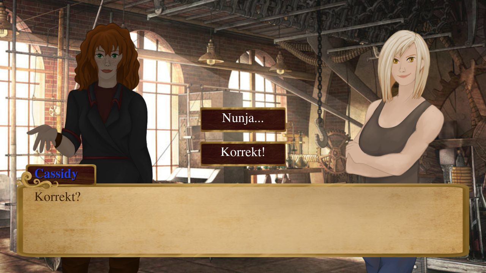
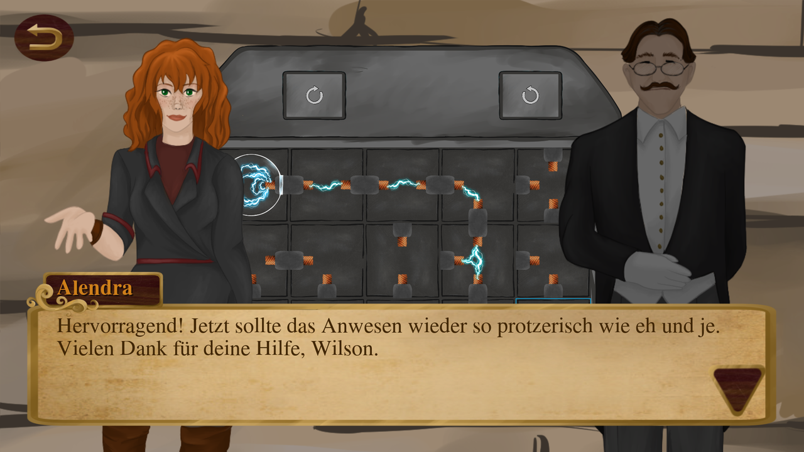
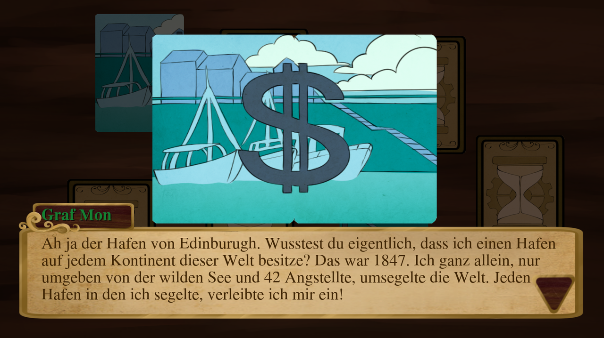

# Steam Clock

**A steampunk visual novel with mini-games that can be played entirely with eye tracking: no mouse clicks, no keyboard.**




> Game language: German · Playtime: about 30 minutes (chapter 1) · Platform: Windows

---

## About

Most narrative games assume that players can click precisely and quickly. For people with motor impairments, that alone can be a barrier. **Steam Clock** asks a simple question: *what does a story game look like if every interaction also works with your eyes alone?*

The result is the first chapter of a steampunk story. Players follow the inventor Alendra, make dialogue choices and solve two puzzles whose outcome changes how the story continues. Everything can be played with a mouse or, after switching on **Hands-Free Mode**, with an eye tracker or any other pointer device, without a single click.

**Context**

- University project in Human-Computer Interaction, documented in a written report of about 20 pages.
- Selected for the **"Rabbit" indie game development grant by Medienboard Berlin-Brandenburg**: a paid one-month residency in a country house together with other indie developers.
- Built solo in about two months: game design, story, programming, UI and theme. Character art was created by a friend; backgrounds are free assets.

## Hands-Free Mode

The core of the project is a **dwell-based input system**: instead of clicking, the player rests their gaze (or cursor) on an element until it activates.

- **Activation without hands.** Hands-Free Mode is switched on in the main menu by dwelling on its checkbox, so even the first step needs no click.
- **Visible progress.** While the player looks at a button, a fill animation shows how close it is to activating.
- **A steady cursor on a shaky input.** As soon as the gaze lands on an element, the real cursor is hidden and a fixed cursor appears in the centre of that element. Eye-tracking jitter no longer makes the target jump around (see [Findings](#findings)).
- **Forgiving for unsteady gaze.** If the gaze slips off a target, the progress drains gradually instead of resetting at once. Small eye movements do not cost the player their progress.
- **One mechanism everywhere.** Menu buttons, dialogue choices, memory cards and puzzle tiles all use the same dwell behaviour, so players only have to learn it once.

The game was tested with a **Tobii eye tracker** and with the built-in **eye-gaze control of macOS**. The game never checks which hardware is used: anything that moves the cursor works, from a dedicated eye tracker to a webcam-based solution or a head mouse.

Technically, the whole input layer is small: a short script attached to UI elements shows the progress bar on hover and sends a regular input signal once the bar is full. The rest of the game does not need to know whether the player clicked or looked.

## Gameplay

- **Branching dialogue.** The story is told through character dialogue and choices, built with the Dialogic plugin.
- **Memory.** Find matching pairs of illustrated cards. Each pair combines into a scene from Count Mon's past and unlocks his story about it; one special card triggers its own event.
- **Powerline puzzle.** Rotate fuse tiles to connect the power supply to its target before you run out of moves. Alendra's companion Wilson can help by rotating tiles the other way, but only a few times. Who makes the winning move changes the dialogue that follows.

| Powerline puzzle | Memory |
| :---: | :---: |
|  |  |

## Playtesting

The game was playtested with about a dozen people: other game developers at the residency, visitors and friends. Most importantly, it was tested by **a player with a spinal cord injury** and **a player with a motor impairment**, the people Hands-Free Mode was designed for. Their feedback shaped how the dwell input behaves.

## Findings

1. **Accessibility does not have to be expensive.** The code that makes the whole game playable with the eyes is only a few small scripts. Building on the existing pointer input instead of a specific device API gave a lot of accessibility for very little code.
2. **Eyes are a precise sense but an imprecise pointer.** Even when concentrating, the eyes make hundreds of tiny corrections. With a visible cursor this turns into constant jitter, and the jitter itself makes it harder to keep looking at one spot. Hiding the real cursor and pinning a fake cursor to the centre of the focused element was the single biggest improvement to the experience.
3. **Hardware independence helps players and developers.** Better hardware makes play more comfortable but is not required. Players can use whatever device they already own, and small indie teams do not have to support individual devices.
4. **Accessible features can be fun for everyone.** Testers without impairments enjoyed Hands-Free Mode as a new way to play. Accessibility can also add a fresh experience for the general audience.

## Tech stack

| Area | Technology |
| --- | --- |
| Engine | Godot 3.4 |
| Language | GDScript |
| Dialogue system | [Dialogic 1.4](https://github.com/coppolaemilio/dialogic) (MIT) |
| Input | Custom dwell / hover input layer on top of Godot's UI system |
| Visuals | Custom UI theme, tweens, shader-based outlines for selected puzzle tiles |

## Project structure

```
Steam_Clock/
├── Scripts/
│   ├── MainMenu.gd                 # menu incl. Hands-Free Mode toggle
│   ├── SliderButton.gd             # dwell progress indicator
│   ├── Utillities/HoverButton.gd   # makes any button dwell-activatable
│   └── Minigames/
│       ├── Memory/                 # memory game logic
│       └── PowerlinePuzzle/        # fuse puzzle: rotation, power flow, win condition
├── Scenes/                         # menus, mini-games, dialogue manager
├── dialogic/                       # characters and story timelines
└── addons/dialogic/                # third-party dialogue plugin
```

## Running the project

1. Install [Godot 3.4.x](https://godotengine.org/download/archive/) (the project does not open in Godot 4 without migration).
2. Open `Steam_Clock/project.godot`.
3. Press **F5** to play. Turn on *Hands-Free Mode* in the main menu to try the dwell input with your mouse.

## Lessons learned

This was one of my first larger projects. Looking back, I would do a few things differently today:

- **Build the dwell input as one reusable component from the start.** It grew organically and now lives in several scripts with slightly different timings. A single input component would make it easier to maintain and test.
- **Expose the dwell time as a player setting.** The timing is adjustable in code, but players with different needs should be able to change it themselves.
- **Keep builds out of the repository** and publish them as releases instead.

## Credits

- **Design, story, programming, UI and memory card illustrations:** Merlin
- **Character art:** created by a friend for this project
- **Backgrounds and sound effects:** free assets
- **Dialogue system:** [Dialogic](https://github.com/coppolaemilio/dialogic) by Emilio Coppola and contributors, MIT License

---

Built by **Merlin** · [GitHub](https://github.com/MerlinSleeps)
